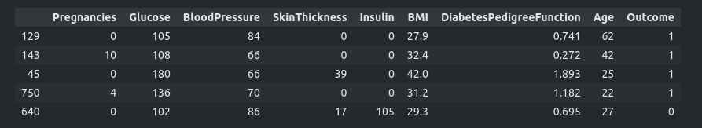

<h1> Diabetes Dataset for Beginners (Kaggle) - ML Python Project</h1>
 
<h2>Features</h2>
<ul>
    <li>The objective of the dataset is to diagnostically predict whether or not a patient has diabetes</li>
    <li>Scaled the features using StandardScaler</li>
    <li>SVM: 81% using GridSearchCV </li>
    <li>Logistic Regression: 80% using GridSearchCV </li>
    <li>KNN: 72% using GridSearchCV </li>
</ul>

<h2>Acknowledgments</h2>

<b> Python3: http://bit.ly/python3-certifications </b>
 
<b> Machine Learning: https://bit.ly/machine-learning-certification <b>
 

<h2>Photo</h2>

 
<h2>Contact</h2>

<b> Email: mariusc0023@gmail.com </b>
