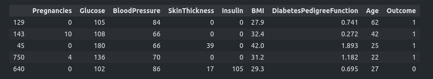

<h1>Predicting Diabetes using Machine Learning in Python on Kaggle</h1>
 
<h2>Features</h2>
<ul>
    <li>The objective of the dataset is to diagnostically predict whether or not a patient has diabetes</li>
    <li>Scaled the features using StandardScaler</li>
    <li>Data visualization with histograms</li>
    <li>SVM: 81% using GridSearchCV </li>
    <li>Logistic Regression: 80% using GridSearchCV </li>
    <li>KNN: 72% using GridSearchCV </li>
</ul>

 

<h2>Photo</h2>

 
<h2>Contact</h2>

<b> Email: mariusc0023@gmail.com </b>
